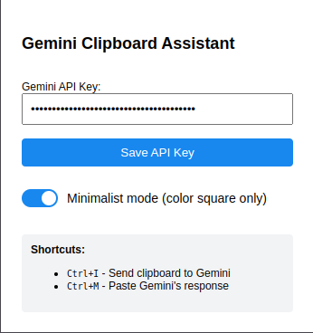

# Gemini Clipboard Assistant

A Chrome extension that sends clipboard content to Google's Gemini 2.0 Flash API and allows you to paste responses with keyboard shortcuts.

## Features

- **Send clipboard content to Gemini**: Press `Ctrl+I` to send your clipboard content to Gemini AI
- **Paste Gemini's response**: Press `Ctrl+M`(chrome) / `Ctrl+Y`(edge) to paste the generated response
- **Context menu integration**: Right-click on selected text and choose "Send to Gemini"
- **Two notification styles**:
  - Minimalist mode: Shows only a small colored square indicator in the top-right corner
  - Detailed mode: Shows toast notifications with status messages
- **Visual feedback**:
  - Green: Success / Response ready
  - Yellow: Processing
  - Red: Error
- **Works everywhere**: Compatible with all websites, including Jupyter notebooks

## Installation

### From Chrome Web Store
*(Coming soon)*

### Manual Installation
1. Download or clone this repository
2. Open Chrome and navigate to `chrome://extensions/`
3. Enable "Developer mode" in the top-right corner
4. Click "Load unpacked" and select the folder containing the extension files
5. The extension is now installed and ready to use

## Setup

1. Click on the extension icon to open the popup
2. Enter your Gemini API key ([Get one here](https://aistudio.google.com/app/apikey))
3. Click "Save API Key"
4. Choose your preferred notification style with the "Minimalist mode" toggle
5. You're all set!

## How to Use

### Basic Usage
1. Copy text to your clipboard (`Ctrl+C`)
2. Press `Ctrl+I` to send the clipboard content to Gemini
3. Wait for visual confirmation (color indicator or notification)
4. Navigate to where you want to paste the response
5. Press `Ctrl+M` (`Ctrl + Y` in Edge) to paste Gemini's response

### Context Menu
1. Select text on any webpage
2. Right-click and select "Send to Gemini"
3. Wait for the response
4. Press `Ctrl+Y` to paste the response

## Notification Styles

### Minimalist Mode
When enabled (default), the extension shows only a small colored square in the top-right corner:
- Yellow: Processing the request
- Green: Response ready to paste
- Red: Error occurred

### Detailed Mode
When minimalist mode is disabled, the extension shows toast notifications with descriptive text:
- Processing notifications show the status of your request
- Success notifications confirm when responses are ready
- Error notifications provide information about what went wrong

## Technical Details

- Built with Chrome's Manifest V3
- Uses the Gemini 2.0 Flash API for efficient text generation
- Securely stores your API key in Chrome's local storage
- Compatible with Content Security Policy (CSP) restrictions
- Works in standard websites and restrictive environments like Jupyter notebooks

## Files

- `manifest.json`: Extension configuration
- `popup.html` & `popup.js`: User interface for API key management
- `background.js`: Background service worker for API communication
- `content.js`: Content script for clipboard operations
- `toast.js`: Visual notification system
- `myicon.png`: Extension icon

## Privacy

- Your API key is stored only in your browser's local storage
- Clipboard data is only sent to Google's Gemini API when you explicitly trigger the extension
- No data is collected or stored by the extension developers

## License

MIT License

## Credits

- Built with Google's Gemini API

## Contributing

Contributions are welcome! Please feel free to submit a Pull Request.
