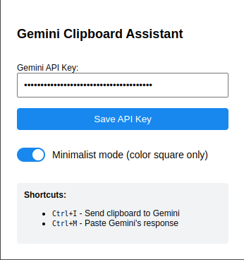

# Gemini Clipboard Assistant

A Chrome/Edge extension that sends clipboard content or screenshots to Google's Gemini API and allows you to paste or display responses with keyboard shortcuts.

## Features

- **Multiple Gemini models**: Switch between Gemini 2.0 Flash, 2.5 Flash, and 2.5 Pro with dynamic thinking
- **JSON response modes**: Get structured answers for multiple-choice questions
  - Single-select mode: Returns one best answer
  - Multi-select mode: Returns multiple correct answers
- **Screenshot analysis**: Automatically captures and analyzes your screen in JSON modes
- **Send clipboard content to Gemini**: Press `Ctrl+I` to send your clipboard content to Gemini AI
- **Paste Gemini's response**: Press `Ctrl+Q` to paste the generated response
- **Model switching**: Press `Alt+V` to toggle between Gemini model versions
- **JSON mode toggle**: Press `Alt+B` to cycle between standard, single-select and multi-select modes
- **Context menu integration**: Right-click on selected text and choose "Send to Gemini"
- **Customizable display**:
  - Choose text color with color picker or presets
  - Select from 9 different screen positions
  - Clockwise rotation option that cycles through corner positions
  - Fine-tune with X/Y offset controls
- **Two notification styles**:
  - Minimalist mode: Shows only a small colored square indicator
  - Detailed mode: Shows toast notifications with status messages
- **Visual feedback**:
  - Green: Success / Response ready
  - Yellow: Processing
  - Red: Error
- **Works everywhere**: Compatible with all websites, including Jupyter notebooks

## Installation

### From Chrome Web Store
*(Coming soon)*

### Manual Installation

#### For Chrome:
1. Download or clone this repository
2. Open Chrome and navigate to `chrome://extensions/`
3. Enable "Developer mode" in the top-right corner
4. Click "Load unpacked" and select the `chrome_version` folder
5. The extension is now installed and ready to use

#### For Microsoft Edge:
1. Download or clone this repository
2. Open Edge and navigate to `edge://extensions/`
3. Enable "Developer mode" in the left sidebar
4. Click "Load unpacked" and select the `edge_version` folder
5. The extension is now installed and ready to use

> **Note**: The Edge version uses different keyboard shortcuts (`Ctrl+I`/`Ctrl+Q`) compared to the Chrome version (`Alt+N`/`Alt+M`).

## Setup

1. Click on the extension icon to open the popup
2. Enter your Gemini API key ([Get one here](https://aistudio.google.com/app/apikey))
3. Click "Save API Key"
4. Configure display options:
   - Choose notification style with the "Minimalist mode" toggle
   - Select your preferred text color
   - Choose where indicators appear on screen
   - Enable Clockwise Rotation for dynamic positioning
5. You're all set!

## How to Use

### Basic Usage
1. Copy text to your clipboard (`Ctrl+C`)
2. Press `Ctrl+I` (Edge) or `Alt+N` (Chrome) to send the clipboard content to Gemini
3. Wait for visual confirmation (color indicator or notification)
4. Navigate to where you want to paste the response
5. Press `Ctrl+Q` (Edge) or `Alt+M` (Chrome) to paste Gemini's response

### JSON Mode for Multiple Choice
1. Press `Alt+B` (Edge) or `Alt+C` (Chrome) to toggle to Single or Multi-select JSON mode
2. Press `Ctrl+I` (Edge) or `Alt+N` (Chrome) to take a screenshot of your multiple-choice question
3. The extension automatically analyzes the image and displays the answer(s)
4. Answer appears in your selected position on screen

### Model Switching
1. Press `Alt+V` to toggle between Gemini 2.0 Flash, 2.5 Flash, and 2.5 Pro models
2. A notification confirms your selection

### Context Menu
1. Select text on any webpage
2. Right-click and select "Send to Gemini"
3. Wait for the response
4. Press `Ctrl+Q` (Edge) or `Alt+M` (Chrome) to paste the response

## Notification Styles

### Minimalist Mode
When enabled (default), the extension shows only a small colored square:
- Yellow: Processing the request
- Green: Response ready to paste
- Red: Error occurred

### Detailed Mode
When minimalist mode is disabled, the extension shows toast notifications with descriptive text:
- Processing notifications show the status of your request
- Success notifications confirm when responses are ready
- Error notifications provide information about what went wrong

## Position Options

The extension offers multiple ways to position indicators on your screen:

### Fixed Position
Select from 9 different screen positions:
- Top: Left, Center, Right
- Middle: Left, Center, Right
- Bottom: Left, Center, Right

### Clockwise Rotation
Enable "Use Clockwise Rotation" to cycle through corner positions:
- Top Left → Top Right → Bottom Right → Bottom Left → repeat

### Fine-Tuning
Adjust the X and Y offset values to fine-tune the exact position.

## Technical Details

- Built with Chrome's Manifest V3
- Uses the Gemini 2.0 Flash, 2.5 Flash, and 2.5 Pro API
- Securely stores your API key in browser's local storage
- Compatible with Content Security Policy (CSP) restrictions
- Works in standard websites and restrictive environments like Jupyter notebooks
- Supports both Chrome and Microsoft Edge browsers

## Files

### Chrome Version (`chrome_version/` folder):
- `manifest.json`: Extension configuration
- `popup.html` & `popup.js`: User interface for settings and API key management
- `background.js`: Background service worker for API communication
- `content.js`: Content script for clipboard operations and visual feedback
- `toast.js`: Visual notification system
- `direct-injector.js`: Direct injection for CSP-restricted environments
- `myicon.png`: Extension icon

### Edge Version (`edge_version/` folder):
- Same file structure as Chrome version
- Uses different keyboard shortcuts (`Ctrl+I`/`Ctrl+Q` instead of `Alt+N`/`Alt+M`)
- JSON mode toggle uses `Alt+B` instead of `Alt+C`

## Privacy

- Your API key is stored only in your browser's local storage
- Clipboard data and screenshots are only sent to Google's Gemini API when you explicitly trigger the extension
- Screenshots are not saved locally or remotely - they are processed and discarded
- No data is collected or stored by the extension developers

## License

MIT License

## Credits

- Built with Google's Gemini API

## Contributing

Contributions are welcome! Please feel free to submit a Pull Request.
